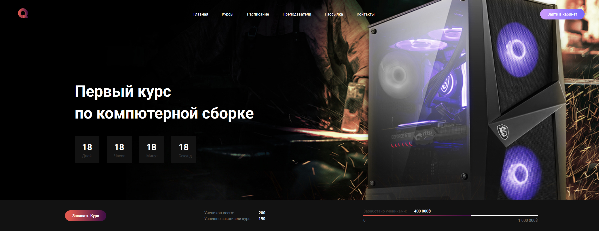

# Landing Page Based on Figma Template

This is a responsive landing page built based on the design from [Figma Template](https://www.figma.com/design/p37dnws5wHX7C2GeyNv8jO/Templates--18.-More-on-Figma.info--Copy-?node-id=10091-4&t=bBNlmbmm0GtP8gkt-0).

## Features

- Clean and modern design following the original Figma layout  
- Built with HTML and CSS (including resets and animations)  
- Fully responsive for desktop and mobile devices  
- Smooth animations to enhance user experience  

## A bit of a story behind this project

I spent a looooong time working on this — with plenty of breaks, late nights, and serious grinding.  
It wasn’t easy and sometimes I really had to push myself hard, but I learned *a lot* along the way.  
Every pixel, every line of code was crafted with care and patience.  

So yeah, it may look simple on the outside, but this project is packed with sweat and dedication.

## Usage

To view the project locally, simply open `index.html` in your browser.

---

Thanks for checking out my work! Feedback and suggestions are always welcome 🙌
